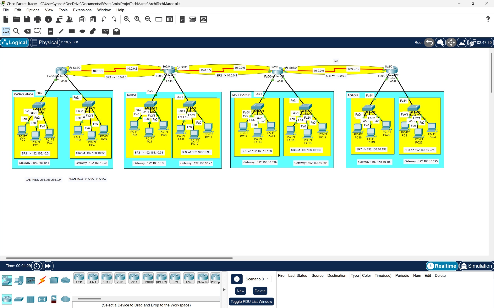

# Multi-Site Network Architecture — TechMaroc SARL

Design and full configuration of a multi-site enterprise network interconnecting four geographic locations across Morocco, simulated in Cisco Packet Tracer.

---

## Network Topology



> Open `ArchiTechMaroc.pkt` in Cisco Packet Tracer to explore the full interactive simulation.

---

## Overview

A fictional company — TechMaroc SARL — is spread across four Moroccan cities. The goal was to design and configure a complete network infrastructure allowing seamless inter-site communication with a structured, scalable IP addressing plan.

| Site | City | Role |
|---|---|---|
| Router_0 | Casablanca | Direction + HR |
| Router_1 | Rabat | Technical support |
| Router_2 | Marrakech | Client support |
| Router_3 | Agadir | Sales team |

---

## Architecture

Each site contains one Cisco router, two LAN switches, and six workstations (3 per LAN). Sites are interconnected via point-to-point WAN serial links in a linear chain:

```
Casablanca → Rabat → Marrakech → Agadir
```

Total infrastructure: 4 routers · 8 switches · 24 workstations

---

## IP Addressing Plan

### LAN Subnets (/27 — up to 30 hosts per subnet)

| Subnet | Network Address | Broadcast | Usable Range |
|---|---|---|---|
| SR1 — Casablanca | 192.168.10.0 | 192.168.10.31 | .1 – .30 |
| SR2 — Casablanca | 192.168.10.32 | 192.168.10.63 | .33 – .62 |
| SR3 — Rabat | 192.168.10.64 | 192.168.10.95 | .65 – .94 |
| SR4 — Rabat | 192.168.10.96 | 192.168.10.127 | .97 – .126 |
| SR5 — Marrakech | 192.168.10.128 | 192.168.10.159 | .129 – .158 |
| SR6 — Marrakech | 192.168.10.160 | 192.168.10.191 | .161 – .190 |
| SR7 — Agadir | 192.168.10.192 | 192.168.10.223 | .193 – .222 |
| SR8 — Agadir | 192.168.10.224 | 192.168.10.255 | .225 – .254 |

### WAN Links (/30 — point-to-point, 2 usable addresses)

| Link | Network | Router A | Router B |
|---|---|---|---|
| Casablanca ↔ Rabat | 10.0.0.0/30 | 10.0.0.1 | 10.0.0.2 |
| Rabat ↔ Marrakech | 10.0.0.4/30 | 10.0.0.5 | 10.0.0.6 |
| Marrakech ↔ Agadir | 10.0.0.8/30 | 10.0.0.9 | 10.0.0.10 |

---

## Configuration

### LAN Interface (FastEthernet)
```cisco
interface FastEthernet0/0
 ip address 192.168.10.1 255.255.255.224
 no shutdown

interface FastEthernet0/1
 ip address 192.168.10.33 255.255.255.224
 no shutdown
```

### WAN Interface (Serial — DCE side sets clock rate)
```cisco
interface Serial2/0
 ip address 10.0.0.1 255.255.255.252
 clock rate 64000
 no shutdown

interface Serial2/1
 ip address 10.0.0.2 255.255.255.252
 no shutdown
```

### Static Routing
```cisco
ip route 192.168.10.64 255.255.255.224 10.0.0.2
ip route 192.168.10.96 255.255.255.224 10.0.0.2
```

Each router was configured with static routes to reach all remote LANs and WAN subnets.

---

## Connectivity Tests

All tests confirmed successful routing across all sites.

**LAN test — Casablanca internal:**
```
Pinging 192.168.10.35 — 4/4 replies, time<1ms, TTL=127, 0% loss
```

**WAN test — Casablanca → Agadir:**
```
Pinging 192.168.10.195 — 4/4 replies, avg 63ms, TTL=124, 0% loss
```

---

## Tech Stack

- **Simulation:** Cisco Packet Tracer
- **Routing:** Static routing
- **LAN subnetting:** /27 (255.255.255.224)
- **WAN subnetting:** /30 (255.255.255.252)
- **Devices:** Cisco routers and switches
- **Protocols:** IP, ICMP

---

## Documentation

The full project report is available in `Reseau_multi_site.pdf`, covering the needs analysis, addressing plan, architecture design, equipment configuration, and connectivity test results.

---

## Project Context

Designed and configured as a 1ère année préparatoire engineering project at ISGA (2024–2025), based on a fictional enterprise case study — TechMaroc SARL.

---

## License

MIT
